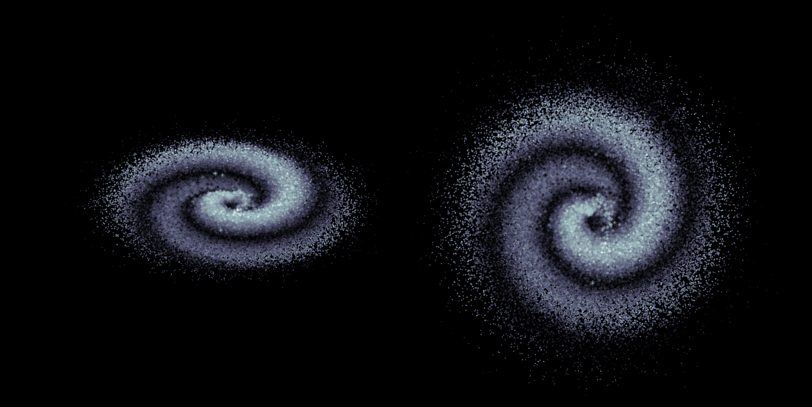

# 3D Galaxy Simulation in MATLAB



Welcome to the 3D Galaxy Simulation in MATLAB repository! This project provides a MATLAB script that generates 3D galaxy models, allowing you to visualize and explore different galaxy structures. Whether you're an astronomy enthusiast, a student, or simply curious about simulating galaxies, this code can provide insights into the complexity of galaxy simulations.

## Getting Started

1. **Clone the Repository:** Start by cloning this repository to your local machine:

   ```bash
   git clone https://github.com/victormeloasm/3DGalaxy.git
   ```

2. **Open MATLAB:** Launch MATLAB on your computer.

3. **Navigate to the Repository:** Use the `cd` command to navigate to the directory where you cloned the repository:

   ```matlab
   cd path/to/3DGalaxy
   ```

4. **Run the Simulation:** Open the `Galaxy.m` script in MATLAB and run it. You can modify the script's parameters to experiment with different galaxy configurations.

## Understanding the Code

The heart of this project is the `Galaxy.m` script. This script allows you to generate 3D galaxy models based on a set of parameters that you define. Let's take a closer look at the key aspects:

### Parameters and Effects

The script allows you to tweak various parameters to create unique galaxy structures:

- `nb_stars`: Number of stars in the galaxy.
- `amplitude`: Thickness of the galactic disk or amplitude of an elliptic structure.
- `radius`: Basis radius for generating star positions.
- `curvature`: Curvature of spiral arms or the elliptic structure.
- `nb_arms`: Number of spiral arms (for spiral galaxy simulations).
- `way`: Rotation direction of the spiral arms.
- `R0`: Radius translation parameter.
- `mean_val`: Influences stars' density at the center.
- `sdn`: Standard deviation factor that affects the star distribution.
- `X_noise_percent`, `Y_noise_percent`, `Z_noise_percent`: Noise levels in each dimension.
- `starsize`: Determines star size based on density or a constant value.
- `az`, `el`, `zoom_lvl`: Parameters for the viewing angle and zoom level.

### Simulating the Galaxy

The script generates a data distribution of stars based on the provided parameters. By using random angles and radii, the script simulates the positions of stars in polar coordinates. These polar coordinates are then transformed into Cartesian coordinates, creating the spatial distribution of stars.

### Visualizing the Galaxy

To make the simulation more realistic, the script adds noise to the coordinates, introducing randomness that mimics the variability observed in real galaxies. Finally, the script uses the `scatter3` function to create a 3D visualization of the simulated galaxy.

## Contributing

This project is open to contributions and improvements. If you find ways to enhance the code, optimize the simulation, or add new features, feel free to submit pull requests!

## License

This project is licensed under the MIT License. Feel free to use, modify, and distribute the code for educational and non-commercial purposes.

## Credits

This project was created by Víctor Duarte Melo. Special thanks to the MATLAB community and contributors for their support.

---

Feel free to copy and paste this text into your `README.md` file on GitHub and customize it further based on your preferences and project details. Make sure to replace placeholders like `yourusername` and include proper attribution and credits.
